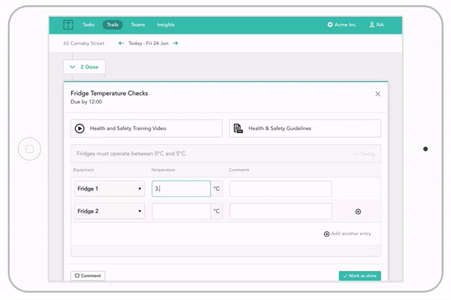

# 

_better store management_

Trail wants to improve the customer experience provided in restaurants and retail stores across the world.

Since April 2014, Trail’s mission has been is to simplify the working day for store staff; Our application's user centric design simplifies the working day. This allows staff to recapture time they want to spend with customers.

With Trail, the Head Office and Ops team can cascade actions and information from multiple sources and track progress & activity. Business intelligence data and brand standards are neatly served up in actionable, bite-sized tasks to store managers – simplifying their work day. With this at its core, Trail changes behaviour and improves store performance.

Within a short space of time we’ve raised significant seed and bridge capital, and signed some key high-street players. With a second round of fundraising underway, and more brands set to join, we’re showing no signs of stopping.

## We

Believe that hiring the best and improving developer experience allows us to deliver more value to our customers and reduce the time we spend maintaining and refactoring.

Use small scrum teams and modern tools like GitHub, CircleCI and Heroku to help us move fast.

Offer flexible hours and remote working. 

Provide the hardware and software you need to get your job done.

Keep Friday afternoons free for so you can research and develop what you want.

## Technologies

`ruby` `ruby-on-rails` `reactjs` `angularjs` `capybara` `postgresql` `redux` `reactjs-flux` `es5` `jsx` `sass` `aws-lambda` 

Our backend is currently written in Rails using Postgres as a data store and Redis and Sidekiq to manage background tasks.

Our frontend is written in React using Flux and now Redux atop of SASS et al.

Our third party data integration and extraction is powered by open source ETL tools and AWS Lambda.

We run end to end tests in Capybara and are constantly looking for ways to automate and improve the way we deliver.

These technologies have allowed us to grow our business quickly but we're not tied to any one thing and we're excited by the opportunites new technology can bring.

## Benefits

-  25 Days Holidays

-  Flexible hours and remote working

-  Employee R&D time

-  Share options

## The App

## Find out more

[http://twitter.com/trailapp](http://twitter.com/trailapp)

[http://blog.trailapp.com](http://blog.trailapp.com)

[http://trailapp.com](http://trailapp.com)

## Team

You can find the team on LinkedIn, [here](https://www.linkedin.com/vsearch/p?f_CC=9249864&trk=rr_connectedness).
